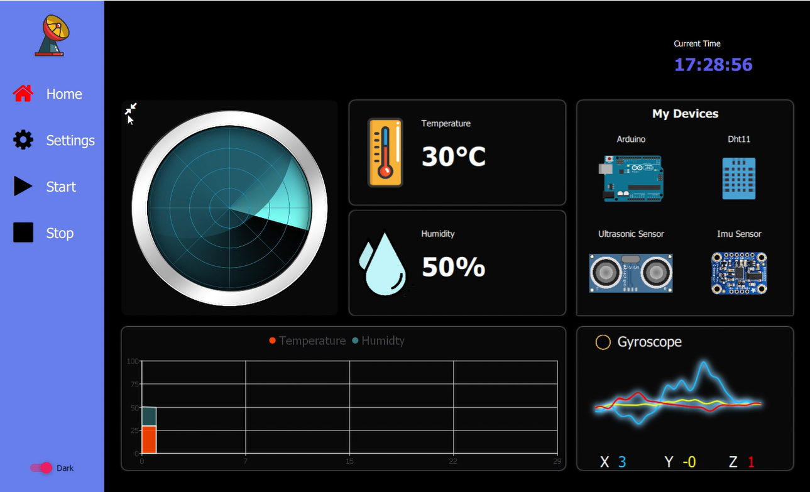
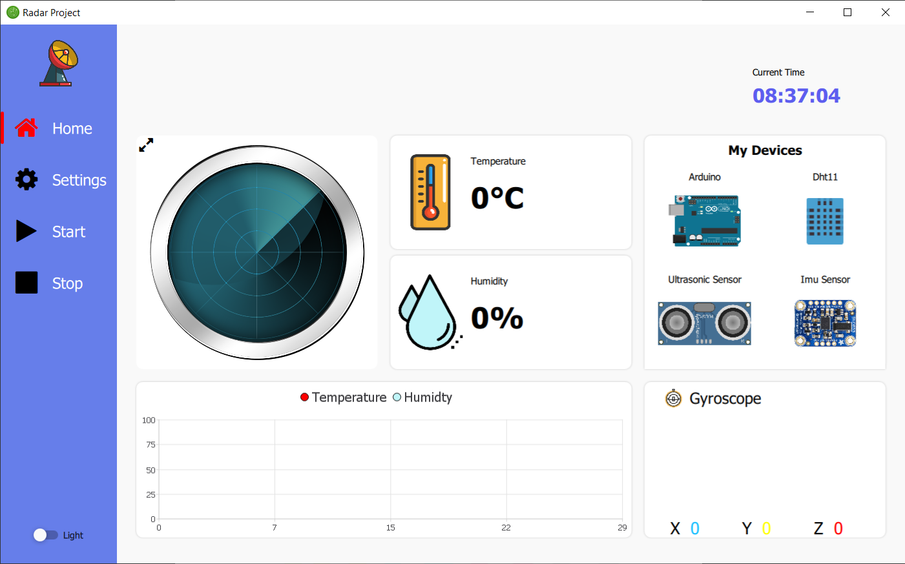
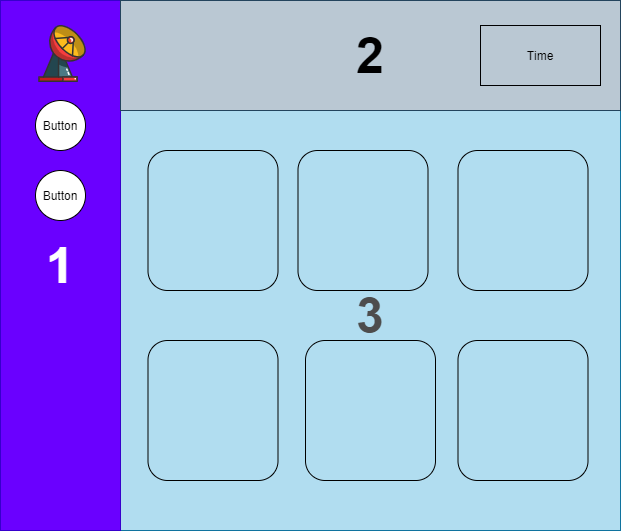
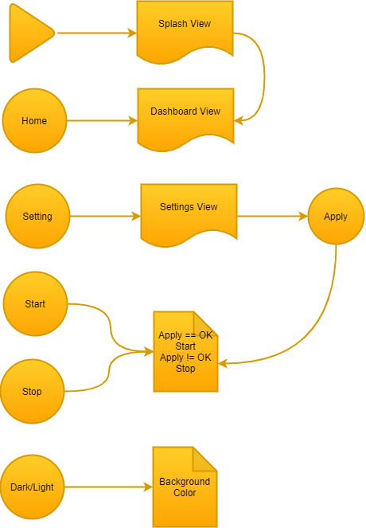
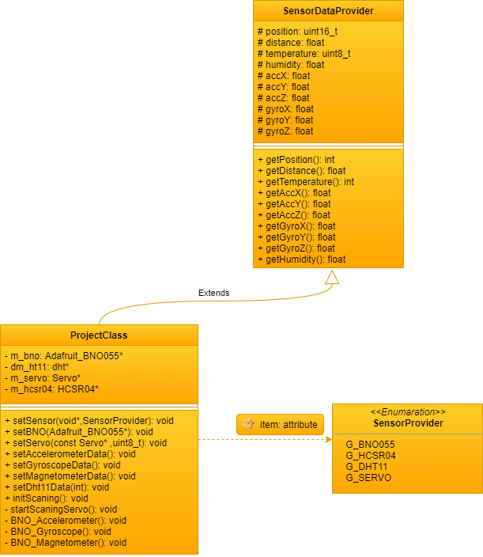
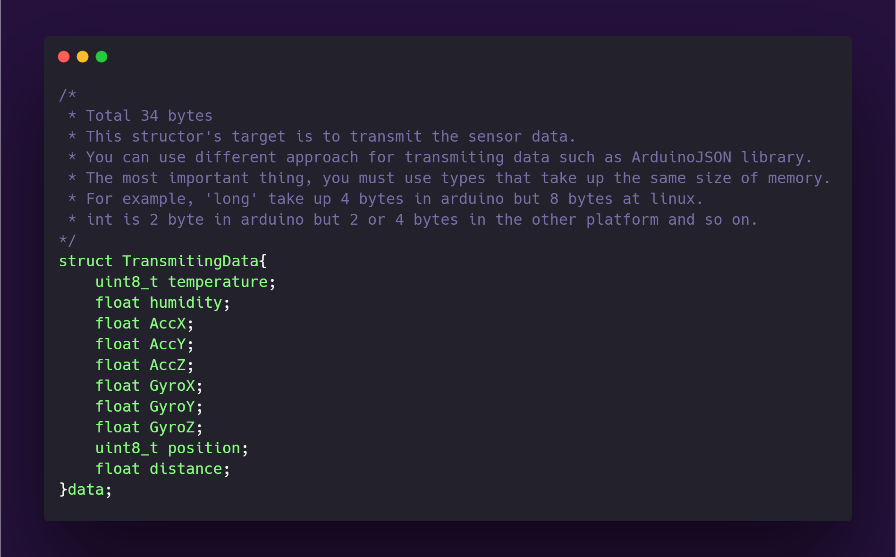

## ULTRASONIC RADAR PROJECT

#### Demo

**Dark mode**

__Ligth mode__

#### Introduction

- The word radar is a combination of ‘Radio Detection And Ranging’.

- Radar system was developed to detect and range approaching enemy aircraft using radio waves.

- Radar system involves two essential components: a ranging device and an angular motor/detector.

- Radar systems use a visualization tool called a plan position indicator.

- In this Project, an ultrasonic sensor(HC-SR04) will be used in place of radio emitter.

- Plan position indicator will be consructed in C++ by recording the angular movement of a servo motor.

- An arduino board will both record the ranging data from the ultrasonic sensor while also controlling and outputting the angular position of the servo motor.

#### Electronic Devices

| Sensor | Dimension (mm) | Wight (gr) | Current (mA) | Voltage (V) | Interface | Price |
| --- |  --- |  --- |  --- |  --- |  --- |  --- |
| BNO055 | 20 x 27 x 4​ | 3 | 12.3 | 3.3V - 5V | I2C & SPI | 182,92₺​ |
| DHT11 | 15 x 25 x 4​​ | 5 | 10.2 | 3.3V - 5V | Digital | 9,10₺​ |
| HC-SR04 |  45 x 20 x 15 | 25 | 15 | 5V | Digital | 7,14₺​ |
| SG90 |  23.1 x 12.2 x 29 | 9 | 250 | 4.8V - 6.0V | Analog | 13,26₺​ |

#### System Circuit Design

#### Demonstration

1. Start communication with Arduino board

1. Create polar plot for radar emulator

1. Begin looping through incoming Arduino data

1. Wait for ‘Start Button’ to begin software.

1. Update scatter points.

#### Purpose of the Project

- Calculating the distance and position of detected object.

- Measurement of environment temperature and humidity.

- Writing software to measurement sensors data using arduino.

- Designing user interface(UI).

- Visualizing sensors data of recieved from arduino using bluetooth or serial communication.

#### User Interface

- First of all, this user interface works cross platform(Windows, MacOS, Linux, Android, IOS) but I just tested on Windows and Android.

- If you use mobile phone, you will not get the performance you expect, because the screen is small but if you use tablet you will see great UI. 

- The UI consists of 3 main part;
    1. The first one is navigation bar.
    2. The second one is to show some data such as time. 
    3. The final one is to show all received data from arduino.

#### User Interface Algorithm

- The user interface pops up splash screen just one time at the opening.

- There are 5 buttons in the navigation bar.

- Each button realize different states.

- Home button goes to dashboard view, setting button goes to settings view.

- Start button activate the communication.

- Stop button stops the communication.

- Dark/Light button is just one button which represent the background color.

#### Arduino Algorithm

#### Transmiting Data From MCU

